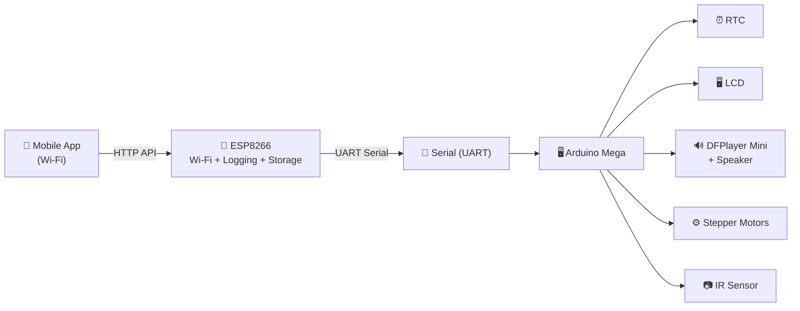
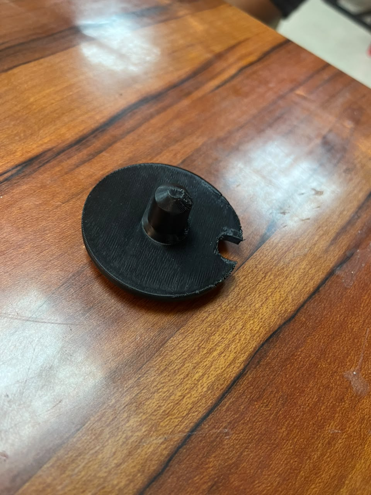
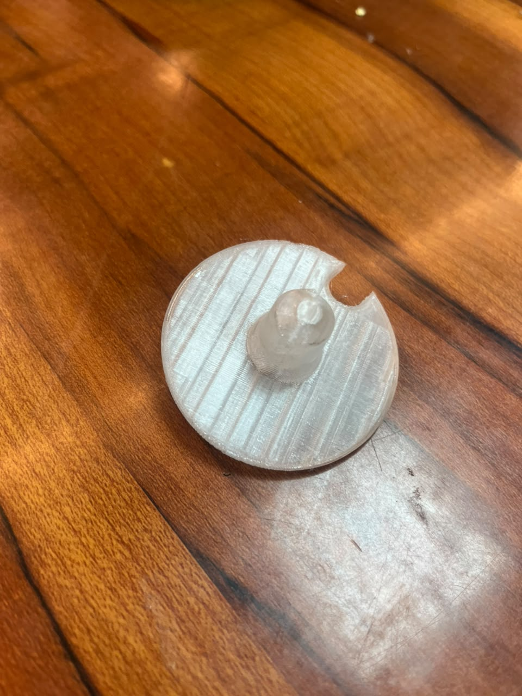
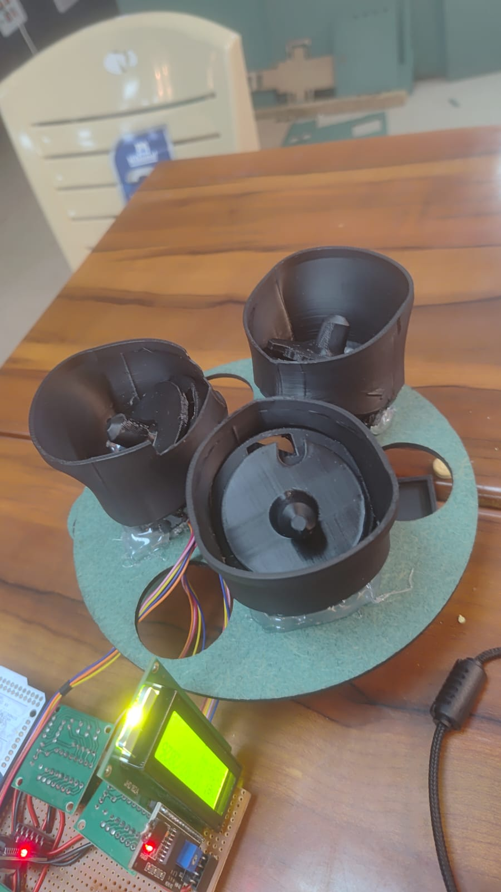
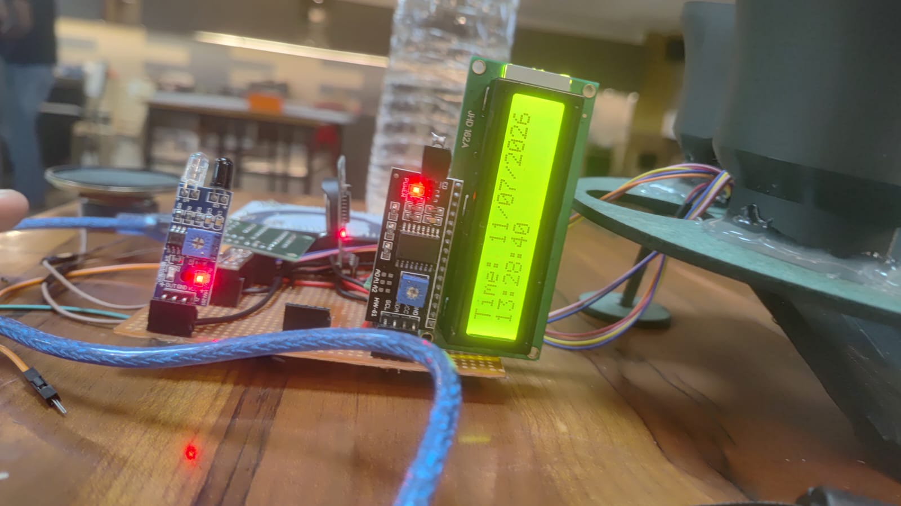
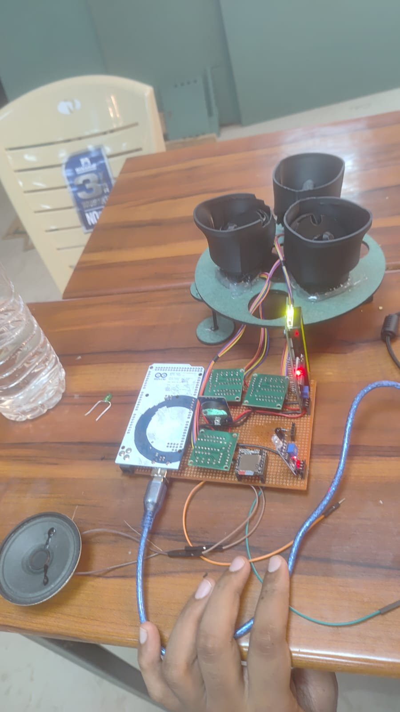

<h1 align="center">⚡ Circuit Breakers</h1>
<h3 align="center">MakerMania 2026 — Innovation Project Workbook</h3>

  
  
  

### 🛠️ Technologies Used

  <strong>Program Duration:</strong> 1 June 2026 – 4 July 2026 &nbsp;·&nbsp;
  <strong>Location:</strong> MBF Tinkerers' Lab 007 &nbsp;·&nbsp;
  <strong>Team Size:</strong> 3 Students

  <em>Identify a real-world problem and develop an innovative, patentable, and implementable solution.</em>

  <a href="https://youtu.be/VeL1t_9wYrM?si=e5plWxUvcQX88zFm"><strong>📺 Advertisement Video</strong></a>
  &nbsp;&nbsp;|&nbsp;&nbsp;
  <a href="https://canva.link/8ibtr7vefrchxkn"><strong>📊 SCAMPER Presentation</strong></a>

---

# 1. Team Identity

## 1.1 Team Name and Photo

Team Name: Circuit Breakers

 
---

## 1.2 Team Members

| Name | Role | Skills |
| ---- | ---- | ------ |
| Rajnarayan Hazra | Hardware & Testing Lead | Arduino Mega programming, serial communication, documentation, electronics assembly |
| Omkar Karale | Software & IoT Lead | ESP8266 programming, app integration, 3D CAD |
| Ekansh Bansode | Mechanical Lead | 3D printing |

---

# 2. Problem Discovery

## 2.1 Observation Area

Where did you conduct your observations?

* Hostel
* Canteen
* Workshop
* **Hospital** (selected)
* Public Transport
* **Home** (selected)
* **Other** — Elderly care and caregiver support (selected)

---

## 2.2 AEIOU Observation Sheet

### Activities

What are users doing?

Users need to take different medicines at fixed times throughout the day (Medicine Scheduling), identify the correct medicine compartment and dosage (Dose Identification via LCD and voice guidance), and retrieve the correct medicine as the device rotates the compartment housing into position using the 28BYJ-48 stepper + ULN2003 (Medicine Retrieval).

### Environment

What conditions affect them?

The device is intended for homes, bedside tables, clinics, and elderly care spaces. Users may face forgetfulness, low vision, difficulty reading labels, or confusion when multiple medicines look similar.

### Interactions

Who or what are they interacting with?

The user interacts with the LCD display, voice announcements, the rotating medicine compartments, and the IR sensor. The companion app connects to the device over Wi-Fi through the ESP8266, which relays commands to the Arduino Mega over a serial connection; the Mega drives the hardware (motor, display, audio, sensor) while the ESP8266 handles logging and storage. Caregivers can use this app connectivity for schedule setup and notifications.

### Objects

What tools or products are used?

ESP8266 DevKit, DS3231 RTC, 16x2 LCD, 28BYJ-48 stepper motor + ULN2003 driver, DFPlayer Mini + speaker, IR sensor, Arduino Mega, and a custom 3D-printed (PLA) medicine compartment housing.

### Users

Who are the primary users?

The primary users are elderly patients and people with complex medication schedules. Secondary users include caregivers, family members, and healthcare workers.

---

## 2.3 Observation Log

| Observation | Evidence | Pain Point |
| ----------- | -------- | ---------- |
| Elderly users may forget medicine timings. | Daily medicine routines often depend on alarms, handwritten notes, or caregiver reminders. | Missed doses reduce treatment effectiveness. |
| Multiple medicines can create confusion. | Similar tablets or unclear compartments make selection difficult. | Users may take the wrong medicine or dosage. |
| Caregivers cannot always monitor intake in person. | Family members may be away during scheduled medicine times. | No reliable confirmation that medicine was accessed. |

---

# 3. User Research

## 3.1 Interview Summary

Number of users interviewed: **Elderly users, family members, and caregivers**

Methods used: Informal interviews, observation, and discussion of daily medicine routines.

## 3.2 Key Quotes

1. "A normal alarm tells the time, but it does not tell which medicine to take."

2. "It is difficult to remember tablets when there are many doses in one day."

3. "Caregivers need to know whether the medicine was actually accessed."

---

## 3.3 User Persona

### Name

Mr. Das

### Age

68 years

### Occupation

Retired

### Goals

Take medicines on time, avoid confusion, and remain independent.

### Frustrations

Forgetting doses, reading small labels, and depending on family members.

### Needs

Clear reminders, voice guidance, visible compartment indication, and simple operation.

---

# 4. Problem Framing

## Problem Statement

User **elderly patients and people with complex medication schedules** needs a way to **identify and take the correct medicine at the correct time** because **missed doses, wrong doses, and dependency on caregivers can affect health and independence**.

---

## How Might We Questions

1. How might we help elderly users identify the correct medicine without confusion?

2. How might we make medicine reminders clearer than a normal phone alarm?

3. How might we help caregivers receive confirmation of medicine access?

---

## Opportunity Ranking

| Criteria         | Score |
| ---------------- | ----- |
| Severity         | 5 — Incorrect or missed medication can directly affect health. |
| Frequency        | 5 — Medicines are often taken daily and multiple times per day. |
| Feasibility      | 4 — Uses affordable and commonly available components. |
| Novelty          | 4 — Combines a custom 3D-printed compartment design, voice guidance, motorized positioning, and IoT. |
| Market Potential | 4 — Useful for elderly care, home healthcare, and caregiver support. |
| Total            | 22/25 |

---

# 5. Solution Ideation

## Brainstormed Ideas

| Idea | Advantages | Challenges |
| ---- | ---------- | ---------- |
| Mobile medicine reminder app | Easy to update schedules and send notifications | Does not physically guide medicine selection |
| Alarm-based pill box | Simple and low cost | User still needs to open the correct compartment |
| Smart rotating medicine organizer | Provides reminder, sorting, voice guidance, visual indication, and access detection | Requires motor calibration and reliable mechanical alignment |

---

## Selected Concept

Why was this concept chosen?

The selected concept is a Smart Medicine Sorting and Reminder Device built using a custom 3D-printed (PLA) compartment housing, designed by taking inspiration from existing web references rather than reusing an off-the-shelf part. It solves both the reminder and medicine identification problems by alerting the user, rotating to the correct compartment, providing voice instructions, and detecting compartment access.

---

# 6. System Design

## High-Level Description

Explain your solution.

The Smart Medicine Sorting and Reminder Device is an IoT-enabled healthcare solution that helps elderly patients and individuals with complex medication schedules take medicines on time and correctly. Medicines are preloaded into weekly compartments inside a custom 3D-printed (PLA) housing. The system runs on two controllers working together: the **Arduino Mega** drives all hardware — reading the DS3231 RTC, updating the 16x2 LCD, playing voice reminders through the DFPlayer Mini and speaker, rotating the 28BYJ-48 stepper motors to the correct compartment, and reading the IR sensor — while the **ESP8266** connects over Wi-Fi to the companion app, sends commands to the Mega over a serial link, and handles log storage. At the correct time, the device announces the reminder, shows medicine information on the LCD, and rotates to the correct slot; the IR sensor detects access and supports logging or caregiver notification. The hardware and software are fully working; current effort is focused on improving the physical enclosure.

---

## Block Diagram

---

## Inputs

List sensors, user inputs, data sources.

* Companion app (via ESP8266 Wi-Fi) — configure schedules and caregiver setup
* DS3231 RTC — accurate real-time scheduling
* IR sensor — detects compartment access or medicine retrieval
* ESP8266 → Arduino Mega (Serial) — relays commands from the app/ESP8266 to the hardware controller

---

## Outputs

List displays, actuators, software outputs.

* 16x2 LCD — shows current time, status, and medication information
* DFPlayer Mini + speaker — voice reminders and dosage instructions
* 28BYJ-48 stepper motors — rotate the compartment housing to the correct slot

---

# 7. Technical Planning

## Electronics

| Component | Purpose |
| --------- | ------- |
| Arduino Mega | Main hardware controller — drives motors, display, audio, and sensor, and receives commands over serial |
| ESP8266 DevKit | Wi-Fi connectivity, app communication, and log storage |
| DS3231 RTC Module | Accurate real-time clock for medicine schedules |
| 16x2 LCD | Displays time, status, and medicine information |
| 28BYJ-48 Stepper Motor (x3) | Rotates the medicine compartments |
| ULN2003 Motor Driver (x3) | Drives the stepper motors |
| DFPlayer Mini + Speaker | Plays voice reminders and dosage instructions |
| IR Sensor | Detects access or retrieval |
| 12V Adapter / 18650 Battery | Power supply |

---

## Software

| Tool | Purpose |
| ---- | ------- |
| Arduino IDE | Firmware development for both ESP8266 and Arduino Mega |
| ESP8266 Arduino Core | ESP8266 programming and wireless features |
| RTC library | DS3231 timekeeping and schedule checking (Mega side) |
| LCD display library | Displaying time, status, and medicine details (Mega side) |
| Stepper motor library | Controlling compartment rotation (Mega side) |
| DFPlayer Mini library | Playing audio reminder files (Mega side) |
| Wi-Fi libraries | Mobile app connectivity and caregiver notifications (ESP8266 side) |
| Serial communication protocol | Passes commands from the ESP8266 to the Arduino Mega |

---

## Mechanical / CAD

Describe fabricated components.

The compartment housing is a custom CAD design, 3D-printed in PLA and built from scratch by taking inspiration from web references — it is not a repurposed 3D-printer filament spool. Multiple sizes and surface finishes were tried across iterations. The housing holds the medicine compartments, motor mounts, and electronics enclosure.

   
  <em>Early PLA compartment lid prototype — printed in black filament</em>

   
  <em>Same lid design reprinted in white/translucent PLA to test a different finish</em>

---

# 8. Prototype Development

## Version 1

Description: Basic circular medicine organizer concept, custom-designed and 3D-printed in PLA (not a recycled filament spool) with marked compartments, inspired by references found online.

Lessons Learned: Compartments must be clearly visible, easy to access, and aligned with the rotation mechanism.

---

## Version 2

Description: Arduino Mega + ESP8266 based prototype with RTC scheduling, LCD display, stepper-based rotation, and serial communication between the two controllers.

Lessons Learned: Accurate timing, motor calibration, and simple feedback are essential for reliable use.

   
  <em>Three 3D-printed compartment housings assembled onto the base with the stepper motors and wiring routed through</em>

---

## Final Prototype

Description: IoT-enabled medicine sorting and reminder device with voice guidance, motorized compartment positioning, LCD status display, and IR access detection. Hardware (Arduino Mega) and software (ESP8266 + companion app) are fully working and communicate correctly over serial and Wi-Fi.

Current Status: The electronics and firmware are functioning as intended, but the 3D-printed enclosure is not yet finalized. Several iterations were tried — different housing sizes and surface/scrubbing treatments — but the model still has fit, alignment, and durability issues and is not fully user-friendly. Following review feedback from the presentation, further redesign of the physical model is in progress.

   
  <em>Close-up of the DS3231 RTC, 16x2 LCD, and IR sensor wired on the breadboard</em>

   
  <em>Full working setup — Arduino Mega, breadboard modules, speaker, and compartment housings connected together</em>

---

# 9. Testing & Validation

## Testing Plan

| Test | Success Criteria |
| ---- | ---------------- |
| RTC schedule reminder | Reminder activates at the programmed time |
| Motor positioning | Compartment housing rotates to the correct slot |
| Voice and sensor feedback | Correct audio plays and access is detected |

---

## User Feedback

| User | Feedback | Action Taken |
| ---- | -------- | ------------ |
| Elderly user | Voice reminders are easier to understand than a simple chime. | Added DFPlayer Mini and speaker for audio guidance. |
| Caregiver | Clear compartment guidance is important to avoid confusion. | Used LCD messaging and mechanical positioning for guidance. |
| Presentation reviewers | The current 3D-printed model is not user-friendly and needs a better enclosure design, even though the hardware and software work correctly. | Redesign of the physical model is underway after trying multiple sizes and surface treatments. |

---

# 10. Innovation Assessment

## Existing Solutions

List competing products.

| Product / Patent | Strengths | Weaknesses |
| ----------------- | ---------- | ----------- |
| Basic pill organizer | Low cost and simple | No automatic reminder, voice guidance, or access detection |
| Phone alarm reminder | Easy to set and portable | Does not identify the correct medicine or compartment |
| Smart pill dispenser | Automated and connected | Often costly |

---

## What Makes This Different?

This project combines a custom-designed, 3D-printed PLA compartment housing, motorized compartment positioning, voice guidance, and IoT connectivity split across an ESP8266 (app/Wi-Fi/logging) and an Arduino Mega (hardware control) working together over serial. It supports elderly users and caregivers with a fully working hardware and software stack, while the physical enclosure continues to be refined for better usability.

---

## Innovation Score

| Parameter       | Score |
| --------------- | ----- |
| Novelty         | 4 — Uses a custom 3D-printed compartment housing, designed from web references, as the main circular medicine organizer. |
| Technical Depth | 4 — Integrates ESP8266, RTC, motor control, audio, display, sensor, and wireless features. |
| Feasibility     | 4 — Uses low-cost and easily available components. |
| Impact          | 5 — Helps reduce missed doses and incorrect medicine intake. |
| Scalability     | 4 — Can be expanded with app support, cloud logs, and caregiver alerts. |

---

# 11. Intellectual Property

## Prior Art Search

Patents / Products Found:

| Reference | Relevance | Differentiation |
| --------- | --------- | ---------------- |
| Traditional pill boxes | Organize medicines by day and time | No motorized slot positioning, voice guidance, or IoT logging |
| Electronic reminder pill boxes | Provide alarm-based reminders | Limited support for identifying the correct compartment |
| Smart pill dispensers | Automate medicine dispensing | Higher cost and not built around a custom low-cost, dual-controller (ESP8266 + Arduino Mega) design |

---

## Novel Features

1. Custom 3D-printed (PLA) circular smart medicine organizer, designed from web references.

2. Motorized compartment positioning combined with voice guidance.

3. Dual-controller architecture — ESP8266 for app connectivity and log storage, Arduino Mega for hardware control — with low-cost access detection and caregiver connectivity.

---

## Provisional Patent Draft

### Title

Smart Medicine Sorting and Reminder Device Using a Custom 3D-Printed Compartment Mechanism

### Abstract

An IoT-enabled medicine organizer built around a custom-designed, 3D-printed PLA circular storage mechanism. The system provides scheduled reminders, motorized compartment positioning, voice guidance, and access detection for medicine retrieval, coordinated through an ESP8266 (connectivity and logging) and an Arduino Mega (hardware control).

### Problem

Elderly patients and users with complex medicine schedules often miss doses or take incorrect medicines due to confusion, forgetfulness, or lack of caregiver support.

### Solution

A low-cost smart organizer that stores weekly medicine doses, alerts the user at scheduled times, rotates to the correct compartment, announces instructions, and detects access.

### Claims

Custom 3D-printed compartment design, scheduled motorized positioning, dual-controller (ESP8266 + Arduino Mega) architecture, and caregiver notification support through ESP8266 connectivity.

---

# 12. Business & Deployment

## Target Users

Elderly patients, people with chronic illnesses, caregivers, families, clinics, and home healthcare providers.

## Estimated Cost

Low-cost prototype using an ESP8266, Arduino Mega, RTC, LCD, motor, audio module, IR sensor, and a custom 3D-printed PLA body.

## Market Opportunity

Growing demand for elderly care, home healthcare, medication adherence tools, and affordable assistive devices.

## Sustainability Considerations

Uses PLA, a biodegradable/plant-derived filament, for the enclosure; enclosure design is being iterated to reduce material waste in future print runs.

---

# 13. Final Demonstration

## Prototype Images

  
  

---

## Demonstration Video Link

---

## GitHub Repository

https://github.com/mbftinkererslab-vesit/MakerMania_2026-

---

## Presentation Link

---

# 14. Reflection

## What Worked Well?

The hardware and software stack works correctly end-to-end — the app, ESP8266, and Arduino Mega communicate reliably, and scheduling, voice guidance, and access detection all function as intended.

## What Failed?

The physical 3D-printed enclosure is not yet reliable or user-friendly. Multiple iterations were tried (different sizes, surface scrubbing/finishing), but alignment, fit, and durability issues remain, as noted in presentation reviews.

## Key Learnings

Healthcare devices must be reliable, simple to use, and clear through both audio and visual feedback — and getting the electronics and firmware working is not enough if the physical enclosure isn't equally refined and user-friendly.

## Next Steps

* Patent Filing
* Startup Exploration
* Product Development
* Research Publication
* Competition Submission

---

# 15. Final Deliverables Checklist

* Problem Discovery Complete ✅
* User Interviews Complete ⬜
* Persona Created ✅
* Problem Statement Finalized ✅
* System Design Complete ✅
* Prototype Demonstrated ⬜
* Testing Completed ⬜
* Patent Draft Prepared ✅
* Presentation Submitted ⬜
* GitHub Repository Updated ✅

---

# MAKERMANIA FINAL PITCH

Each team will present:

1. Problem: missed and incorrect medicine intake
2. User Research: elderly users and caregivers need clearer reminders
3. Insights: voice, visual, and physical positioning reduce confusion
4. Solution: smart rotating medicine organizer using a custom 3D-printed compartment housing
5. Prototype Demo: reminder, voice instruction, and motor rotation
6. Innovation & Patentability: low-cost, dual-controller IoT device with a custom-designed enclosure
7. Future Roadmap: refined and more user-friendly enclosure, app connectivity, caregiver alerts, and logging

Presentation Time: 5 Minutes

Q&A: 3 Minutes
